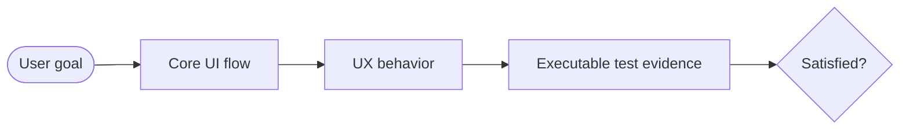

# Analyze UI

Evaluate the UI situation end to end: what the product experience is, whether it is good enough for users, and whether tests provide real confidence in that experience.

## Definition Of Satisfied

Mark the UI/UX as **satisfied** only when the evidence supports all of these:

- Core user flows are identified and can be exercised.
- Important happy paths, alternate paths, validation, loading, empty, disabled, permission, and error states behave coherently.
- Layout, navigation, copy, affordances, hierarchy, and feedback support the user's intent without obvious friction.
- Basic accessibility expectations are met: keyboard reachability, focus behavior, labels, semantic roles, contrast-sensitive states, and announced errors/statuses where applicable.
- The UI has small, meaningful tests for the important flows and states, preferably without live backend integration.
- Documented features have stable flow IDs, executable tests, and current screenshots/videos or visual artifacts generated by those tests when visual documentation is useful.
- Remaining issues are minor, documented, and unlikely to block the target user from completing core tasks.

Do not mark satisfied when core flows cannot be observed, critical UX paths are broken, severe responsive/accessibility issues remain, important behavior has no executable test evidence, or docs describe UI features that are not correlated to flow IDs/tests/artifacts.

## Workflow

1. **Scope the evaluation.** Identify the app area, target users, supported platforms/viewports, and the standard for "satisfactory" in this context. If the user invoked a goal like `/analyze-ui`, treat the goal as an outcome to prove or disprove.
2. **Gather evidence.** Prefer running the app and tests. Also inspect routes, components, state management, styling, tests, generated screenshots/videos, docs asset directories, Storybook/screenshots, fixture data, UI docs, and the outputs of `document-ui-flows` or `enforce-testable-ui-flows` when available.
3. **Map the core flows.** If no flow map exists, create a compact one. Focus on the user journeys that define whether the UI is usable, not every minor component.
4. **Assess UX quality.** Evaluate task clarity, navigation, feedback, validation, state handling, information hierarchy, visual consistency, responsiveness, accessibility basics, and failure recovery.
5. **Assess test evidence.** Map each important flow/state to tests. Distinguish small backend-free UI tests, component/view-model tests, backend-free Playwright workflow tests, adapter/contract tests, and end-to-end smoke tests.
6. **Inspect testability architecture.** Check whether UI behavior is isolated behind repository/service interfaces, fakes, fixtures, dependency injection, and deterministic harnesses. Flag backend-coupled tests that should be smaller.
7. **Assess docs correlation.** Check whether docs pages reference the same flow IDs as the UX flow diagram, whether docs screenshots/videos are generated by tests, and whether the docs build consumes those artifacts.
8. **Run relevant checks.** Use the repo's existing test/lint/typecheck/docs commands and browser automation when available. Do not invent results when tooling cannot run.
9. **Decide satisfaction.** Give a clear verdict, confidence, blockers, and the smallest concrete work needed to become satisfied.

## Output Format

Use this format for goal or review reports:

````markdown
# UI/UX Satisfaction Report: <app or area>

Verdict: Satisfied / Not satisfied / Conditionally satisfied
Confidence: High / Medium / Low

## Evidence

- App inspected: <routes/screens/components>
- Behavior observed: <running app, generated screenshots/videos, code, tests>
- Commands run: <test/lint/typecheck/build/browser/docs commands and result>
- Not covered: <areas not inspected>

## Situation Diagram



## Scorecard

| Area | Rating | Evidence | Blocking issues |
| --- | --- | --- | --- |
| Core flow completeness | pass/warn/fail | <observed flows> | <issues> |
| Interaction and feedback | pass/warn/fail | <validation, loading, errors> | <issues> |
| Visual and responsive UX | pass/warn/fail | <layout/viewports/screenshots> | <issues> |
| Accessibility basics | pass/warn/fail | <keyboard, roles, labels, focus> | <issues> |
| Test coverage of UI stories | pass/warn/fail | <tests mapped to flows> | <issues> |
| Backend-free testability | pass/warn/fail | <interfaces, fakes, fixtures> | <issues> |
| Docs-to-flow correlation | pass/warn/fail | <flow IDs, docs anchors, diagram nodes> | <issues> |
| Evergreen docs artifacts | pass/warn/fail | <generated screenshots/videos/docs build> | <issues> |

## Flow-To-Test Coverage

| Flow ID | Flow/story/state | UX expectation | Test evidence | Docs artifact | Gap |
| --- | --- | --- | --- | --- | --- |
| FLOW-001 | <flow> | <expected user-visible behavior> | <test file or missing> | <screenshot/video/docs anchor> | <gap> |

## Findings

### Blocking

- <issue, evidence, impact, fix>

### Important

- <issue, evidence, impact, fix>

### Polish

- <issue, evidence, impact, fix>

## Recommendation

- <satisfied/not satisfied rationale>
- <smallest next changes to reach satisfied>
````

## Rating Rules

- **pass** means the area has observed behavior plus adequate test evidence for the relevant risk.
- **warn** means behavior appears acceptable but evidence is incomplete, edge states are weak, or tests are too broad/flaky/backend-coupled.
- **fail** means users are blocked, behavior is incoherent, critical states are missing, or there is no meaningful test evidence for important UI behavior.

Use "not inspected" instead of pass/warn/fail when evidence was unavailable.

## UX Review Heuristics

Check these before giving the verdict:

- The primary action on each screen is obvious, correctly enabled/disabled, and gives feedback.
- Navigation preserves context and offers a recoverable path after errors, empty states, or cancellation.
- Forms explain requirements before or during input, not only after failure.
- Loading and async states prevent duplicate or contradictory actions.
- Errors explain what happened and what the user can do next.
- Destructive actions require appropriate confirmation or undo.
- Tables/lists/search/filter/sort/pagination make the current state legible.
- Responsive layouts remain usable on the target viewport range.
- Copy uses product language that matches the user's goal.
- The UI does not depend on hidden backend state to make basic behavior testable.
- Documentation screenshots/videos match tested user flows and are generated from deterministic fixtures.

## Test Evidence Heuristics

Treat UI tests as strong only when they prove user-visible behavior:

- Good: "submitting invalid email shows inline error and keeps focus in the form."
- Good: "permission denied repository result renders disabled action with explanation."
- Good: "empty project list shows empty state and create action."
- Weak: "component renders" with no user-facing assertion.
- Weak: "calls API mock with payload" without proving the UI outcome.
- Weak: only one full end-to-end test that requires a live backend for many unrelated flows.
- Weak: manually captured docs screenshots with no test that refreshes them.
- Weak: docs that describe a feature not present in the flow diagram or flow-to-test matrix.

Prefer small tests built with fakes and fixtures for most UI/UX behavior, plus a few integration or end-to-end smoke tests for wiring.

## Goal Handling

For a goal like `/analyze-ui is satisfied with the UI/UX`, continue until one of these is true:

- The report shows **Satisfied** with high or medium confidence and names the evidence.
- The report shows **Conditionally satisfied** with explicit accepted risks and non-blocking gaps.
- The report shows **Not satisfied** and lists the minimal blockers that must be fixed before the goal can honestly be called complete.

If the user asks to fix the blockers, use the existing repo patterns and the testability rules from `enforce-testable-ui-flows` before adding broad end-to-end coverage.
