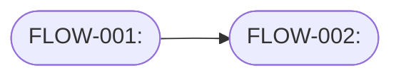

# Document UI Flows

Analyze an application UI as a product system and turn observed behavior into documentation that a product, design, QA, or engineering team can use.

## Workflow

1. **Scope the evidence.** Identify the app type, target users, entry points, available artifacts, and whether the app can be run. Prefer observed behavior from a running app, screenshots, Storybook, tests, route definitions, component code, handlers, API calls, and product copy. Mark inferred behavior explicitly.
2. **Map the interface.** List screens, routes, navigation surfaces, forms, commands, modals, drawers, tables, empty/loading/error/success states, role gates, and responsive or platform-specific variants.
3. **Extract behaviors.** For each user-facing feature, trace the trigger, preconditions, UI state transitions, validation, feedback, persistence, API/data dependencies, permissions, and recovery paths.
4. **Group by user intent.** Document flows by what the user is trying to accomplish, not by component names. Merge duplicate paths and call out where the same flow has different roles, states, or entry points.
5. **Assign stable flow IDs.** Give each documented feature or flow a stable ID such as `FLOW-001`, `INVITE-TEAMMATE`, or the repo's existing docs/test ID style. Use the same ID in diagrams, test names, screenshot/video artifact names, and documentation anchors.
6. **Create the diagram.** Prefer Mermaid in Markdown unless the user asks for another format. Use `flowchart LR` for feature maps, `stateDiagram-v2` for state-heavy interactions, and `sequenceDiagram` for API-heavy flows. Keep diagrams readable; split large systems into multiple diagrams when a single diagram exceeds about 12 nodes.
7. **Write flow documentation.** For every important flow, include the user story it enables and the observable behavior that supports it. Do not invent flows that are not supported by evidence; capture gaps as open questions.

## Output Format

Use this structure unless the user requests a different artifact:

````markdown
# UI Behavior Map: <app or area>

## Evidence

- Sources analyzed: <running app, files, screenshots, tests, routes, etc.>
- Observed directly: <key behaviors>
- Inferred: <behaviors inferred from code or naming>
- Not covered: <areas unavailable or intentionally skipped>

## Feature And Flow Diagram



## Flow Index

| Flow ID | Flow | Primary docs anchor | Test/artifact anchor |
| --- | --- | --- | --- |
| FLOW-001 | <flow name> | <docs page or section> | <test/artifact name> |

## Flows

### FLOW-001: <Flow Name>

- User story: As a <actor>, I want <goal>, so that <benefit>.
- Actors: <roles or user types>
- Entry points: <routes, buttons, links, deep links, notifications>
- Trigger: <user action or system event>
- Preconditions: <auth, data, permissions, feature flags>
- Happy path: <numbered behavior sequence>
- Alternate/error paths: <validation, empty state, failure, cancellation, retries>
- UI states and feedback: <loading, disabled, success, toast, inline error, modal state>
- Data and integrations: <entities, APIs, storage, side effects>
- Enabled feature(s): <product capabilities this flow supports>
- Documentation anchor: <mdBook/AsciiDoc/page section that documents this flow>
- Test/artifact anchor: <backend-free test and generated screenshot/video artifact, if known>
- Open questions: <unknowns, missing states, ambiguous behavior>

## Gaps And Opportunities

- <missing flow/state/permission/error handling/documentation gap>
````

## Diagram Guidelines

- Label nodes with user-visible concepts when possible: `Invite teammate`, `Review cart`, `Payment failed`.
- Use decision nodes for branches: `{Valid input?}`, `{Has permission?}`, `{Inventory available?}`.
- Use subgraphs for major product areas, roles, or lifecycle phases.
- Show system feedback as first-class nodes when it changes user behavior: `Inline validation`, `Retry toast`, `Empty state`, `Confirmation modal`.
- Keep arrows meaningful. Label branches with short verbs or conditions such as `submit`, `cancel`, `invalid`, `approved`.

## Analysis Checklist

Check for these common UI behaviors before declaring the map complete:

- Authentication, authorization, onboarding, and role-specific navigation.
- Create, read, update, delete, import, export, search, filter, sort, pagination, and bulk actions.
- Form validation, destructive confirmations, autosave/manual save, undo, cancellation, and retry behavior.
- Empty, loading, disabled, optimistic, success, warning, and error states.
- Notifications, modals, drawers, popovers, command palettes, contextual menus, keyboard shortcuts, and drag/drop.
- Data dependencies, background jobs, real-time updates, offline behavior, and external integrations.
- Accessibility-relevant behavior: focus management, keyboard reachability, labels, error announcement, and reduced-motion considerations.

## Reporting Rules

- Separate **observed**, **inferred**, and **unknown** behavior.
- Prefer concrete file references, route names, screenshots, test names, or commands as evidence when available.
- Keep flow IDs stable once docs or tests reference them. Rename labels freely, but change IDs only with a coordinated docs/test migration.
- Correlate every documented feature with a flow ID so `enforce-testable-ui-flows` can prove the docs and generated screenshots/videos from tests remain current.
- Avoid turning the document into a generic UX critique unless the user asks for recommendations. When behavior is missing or ambiguous, put it under gaps or open questions.
- If writing into the repo, choose a docs location that matches existing conventions. If no destination is obvious, return the Markdown artifact in the response.
