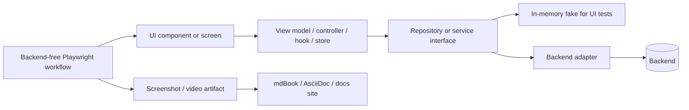

# Enforce Testable UI Flows

Turn documented UI flows into backend-free test coverage by isolating product behavior behind interfaces and driving the UI with fakes, fixtures, and deterministic state.

## Relationship To Flow Documentation

Use `document-ui-flows` output as the preferred input when available. Treat each discovered flow, user story, alternate path, error state, permission state, and empty/loading state as a test obligation. Preserve the flow IDs from that document and reuse them in test names, artifact names, and docs anchors.

If no flow document exists, first inventory the UI enough to identify the flows and states that need tests. Do not wait for a complete product spec before protecting visible behavior.

Documented features are not considered complete unless they are correlated to a flow ID and backed by an executable test that can refresh any screenshots, videos, or visual artifacts used by the docs.

## Workflow

1. **Build a flow-to-test-docs matrix.** List every documented flow/story/state and classify it as covered, partially covered, missing, or blocked. Include the expected test level, the dependency that must be faked, the docs page/anchor, and generated screenshot/video artifacts.
2. **Find backend coupling.** Inspect UI code for direct HTTP calls, SDK clients, global stores, browser storage, time, randomness, routing, auth, feature flags, and background jobs that make small tests require a real backend.
3. **Define ports.** Introduce repository/service interfaces at the smallest useful boundary: data loading, commands, auth/session, permissions, feature flags, uploads/downloads, notifications, clocks, routing, analytics, and realtime subscriptions.
4. **Provide test adapters.** Add in-memory repositories, fake services, fixture builders, controllable promises/tasks, fake clocks, route harnesses, and event emitters that can reproduce happy paths and failures deterministically.
5. **Inject dependencies.** Wire UI components, view models, controllers, hooks, stores, or presenters through explicit dependencies. Prefer local constructors, providers, context, app state, or test harness factories already used in the repo.
6. **Add browser workflow tests where applicable.** Use Playwright for flows that depend on real browser behavior: routing, focus, keyboard navigation, drag/drop, file inputs, responsive layout, dialogs, popovers, canvas, downloads, clipboard, or multi-step page workflows. Run these against a backend-free in-browser-only version of the page that uses fake repositories/services and fixture data.
7. **Generate docs artifacts from tests.** Configure workflow tests to produce deterministic screenshots, videos, traces, or short clips for documented flows. Store or copy the stable artifacts into the project's documentation asset tree for mdBook, AsciiDoc, Docusaurus, Storybook docs, or the local docs system.
8. **Write small tests for behavior.** Assert user-visible outcomes and state transitions: rendered text, enabled/disabled controls, validation messages, focus movement, navigation requests, optimistic updates, retries, and recovery. Avoid asserting implementation details unless the UI behavior cannot be observed otherwise.
9. **Keep backend integration separate.** Use a small number of contract or adapter tests for real API clients. Do not make every UI/UX story depend on network, database, auth server, or production-like seed data.

## Required Output

When reporting or writing documentation, include:

````markdown
## UI Testability Matrix

| Flow ID | Flow/story | UI behavior to prove | Dependency seam | Fake/fixture | Test status | Test file | Docs anchor | Generated artifact |
| --- | --- | --- | --- | --- | --- | --- | --- | --- |
| FLOW-001 | <flow> | <observable outcome> | <repository/service/port> | <fake adapter> | missing/added/existing | <path> | <docs page#anchor> | <screenshot/video path> |

## Testability Architecture



## Gaps

- <flow or state that still lacks a small backend-free test>
- <coupling that still prevents deterministic UI tests>
- <documented feature without a correlated flow ID, test, or refreshed docs artifact>
````

Use Mermaid unless the user or repo documentation format requires another diagram style.

## Interface Design Rules

- Name interfaces by product capability, not transport: `ProjectRepository`, `SessionService`, `FeatureFlags`, `UploadService`, `BillingGateway`. Avoid names like `ApiClient` unless the interface truly represents protocol mechanics.
- Keep interfaces narrow enough that each UI area can fake only what it needs.
- Return domain-shaped results that match UI decisions: success, validation failure, permission denial, not found, empty, conflict, offline, timeout, server error.
- Model loading and failure states explicitly so tests can pause before resolution and assert spinners, skeletons, disabled controls, retries, and cancellation.
- Keep side effects observable through injected dependencies: navigation, notifications, clipboard, downloads, analytics, local storage, clock, randomness, and realtime events.
- Do not hide important behavior inside mocks that only assert calls. Prefer fakes that update state and let the UI prove the user-facing result.

## Test Design Rules

- One documented flow should have at least one small test for the happy path and targeted tests for important alternate/error states.
- One documented feature should have a correlated flow ID, executable test, and documentation artifact when visual evidence is useful.
- Test names should read like user stories or behavior statements.
- Drive tests through user actions where practical: click, type, tab, submit, drag, choose file, navigate.
- Assert accessible UI where practical: roles, labels, focused element, error text, status text, disabled state, route change, and visible list/table contents.
- Use fixture builders for setup data. Keep fixtures close to domain vocabulary rather than raw backend JSON.
- Keep adapter/contract tests separate from UI behavior tests. The UI test should prove "the screen handles permission denied"; the adapter test should prove "403 maps to permission denied."

## Playwright Workflow Tests

Add Playwright tests where a browser is the right unit of proof. These tests should run the page in a real browser but still avoid backend integration:

- Serve or mount a test version of the page with in-memory repositories, fake services, fixture builders, fake auth/session, fake feature flags, fake clocks, and deterministic route state.
- Do not require a live API, database, auth provider, object storage, queue, or production seed data.
- Prefer dependency injection or a test app entry point over request interception. Use route interception only when the app cannot yet inject a backend-free adapter, and treat that as a testability gap.
- Cover complete workflows that smaller component tests cannot prove: navigation across screens, focus order, keyboard shortcuts, drag/drop, file picking, responsive behavior, popovers/modals, browser validation, canvas interactions, and download/clipboard flows.
- Keep Playwright assertions user-visible: roles, labels, text, URL/route, focused element, disabled/enabled controls, toast/status text, list contents, dialog state, and layout-critical visibility.
- Run Playwright against a local static/dev server or framework test harness that serves only frontend assets and in-browser fake data.
- Capture deterministic screenshots at meaningful points in the flow, and videos or traces for flows where motion, drag/drop, animation, multistep timing, or regression diagnosis matters.
- Name tests and artifacts with the stable flow ID from `document-ui-flows`, for example `FLOW-001-invite-teammate.spec.ts`, `FLOW-001-success.png`, or `FLOW-001-workflow.webm`.

## Evergreen Documentation Artifacts

Use tests as the source of truth for visual documentation:

- Store generated screenshots/videos where the docs build can consume them, such as `docs/assets/ui/`, an mdBook source asset directory, `src/docs/assets/`, `antora/modules/ROOT/assets/images/`, or the repo's established docs asset directory. Do not write into generated documentation output directories.
- Reference those artifacts from mdBook Markdown, AsciiDoc, Docusaurus, Storybook docs, or the local documentation system instead of manually captured screenshots.
- Keep docs prose, flow IDs, diagram nodes, test names, and artifact filenames correlated. A reader should be able to move from a docs section to the UX flow diagram and to the test that refreshes the image.
- Prefer deterministic fixture data, fixed clocks, stable viewport sizes, disabled random animations, and seeded IDs so screenshots remain reviewable.
- Decide whether screenshots/videos are committed or generated in CI according to the repo's existing docs workflow. If generated in CI, ensure the docs build depends on the artifact-producing test step.
- Treat a documented feature with no backend-free test as a documentation gap. Treat a docs screenshot/video that is not produced by a test as stale unless the repo has a deliberate exception.
- Add a check, manifest, or matrix when practical so CI can detect missing correlations between flow IDs, docs anchors, tests, and artifacts.

## Refactoring Heuristics

Apply the smallest architectural change that makes the flow testable:

- If a component directly calls `fetch`, Axios, GraphQL, Tauri commands, native bridges, or SDKs, move that behind a repository/service interface.
- If a global singleton blocks tests, wrap it in an injected dependency or provider.
- If async timing is flaky, use controllable promises/tasks, fake clocks, or explicit state machines.
- If a store mixes backend calls with UI state, split transport adapters from view state or command handlers.
- If tests require a server only for seed data, replace that setup with fixture builders and an in-memory fake.
- If workflow tests need Playwright, create a backend-free page variant or test app entry point before wiring tests to a live backend.
- If docs contain manual screenshots, replace them with artifacts produced by backend-free workflow tests or record the exception.
- If docs describe a feature that is absent from the flow diagram, add a stable flow ID and diagram node before adding tests.
- If every fake must implement a large interface, split the interface by UI capability.

## Implementation Guidance

Follow the repository's existing framework and testing stack. Prefer established patterns in the codebase over introducing a new architecture vocabulary.

When making changes:

- Keep write scope close to the UI feature, its dependency boundary, fake adapter, and tests.
- Add or update the test harness before broad rewrites.
- Preserve real backend behavior by adapting existing clients behind the new interface.
- Leave a clear matrix showing every discovered/documented flow, whether it is testable without backend integration, and which docs artifact it refreshes.
- Run the smallest relevant UI test command first, then backend-free Playwright workflow tests that refresh documentation artifacts where applicable, then docs build commands, then broader checks when the changed boundary is shared.
